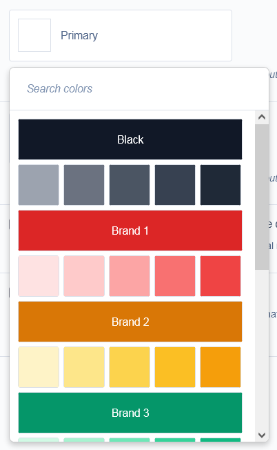

# Colorpicker Module

This module adds a color picker field which can be used anywhere in the CMS.

In order to keep the site accessible, custom color selection is not implemented.



## Installation

To install this module, you can do so with Composer:

```
composer require sitelease/colorpicker
```

## Usage

You can use the `ColorPickerField` as follows:

```php
    use Sitelease\Colorpicker\Forms\ColorPickerField;
    //...

    public function getCMSFields()
    {
        $fields = parent::getCMSFields();

        $fields->addFieldsToTab(
            'Root.Main',
            [
                ColorPickerField::create(
                    'MyColorField',
                    _t(
                        __CLASS__ . '.MyColorField',
                        'My Color Field'
                    ),
                    [
                        [
                            'Title' => 'Red',
                            'CSSClass' => 'red',
                            'Color' => '#E51016',
                        ],
                        [
                            'Title' => 'Blue',
                            'CSSClass' => 'blue',
                            'Color' => '#1F6BFE',
                        ],
                        [
                            'Title' => 'Green',
                            'CSSClass' => 'green',
                            'Color' => '#298436',
                        ]
                    ]
                )
            ]
        );

        return $fields;
    }
```

## Sitelease Alterations
This module was based off of Silverstripe's official [colorpicker module](https://github.com/silverstripe/silverstripe-colorpicker) however we have modified it's styling and structure to work better with our theme colors system.

Here are the changes:
- All color labels are hidden by default
- Swatches are larger and have hover effects
- Every sixth label is displayed on a full width swatches
- Popup interface is smaller

## Versioning

This library follows [Semver](http://semver.org). According to Semver, you will be able to upgrade to any minor or patch version of this library without any breaking changes to the public API. Semver also requires that we clearly define the public API for this library.

All methods, with `public` visibility, are part of the public API. All other methods are not part of the public API. Where possible, we'll try to keep `protected` methods backwards-compatible in minor/patch versions, but if you're overriding methods then please test your work before upgrading.
